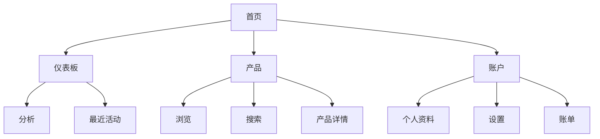
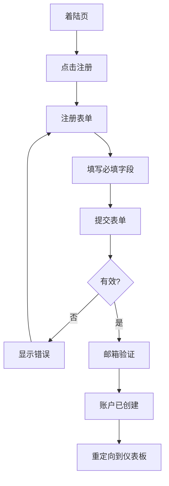

# {{项目名称}} UI/UX 规范

[[LLM: 除非另有说明，默认路径和文件名为 docs/front-end-spec.md]]

[[LLM: 审查提供的文档，包括项目简介、PRD和任何用户研究，以收集背景信息。在开始规范之前，专注于理解用户需求、痛点和期望结果。]]

## 简介

[[LLM: 建立文档的目的和范围。保留以下内容，但确保项目名称被正确替换。]]

本文档定义了{{项目名称}}用户界面的用户体验目标、信息架构、用户流程和视觉设计规范。它作为视觉设计和前端开发的基础，确保连贯且以用户为中心的体验。

### 整体UX目标和原则

[[LLM: 与用户合作建立并记录以下内容。如果尚未定义，促进讨论以确定：

1. 目标用户画像 - 引出详细信息或确认PRD中的现有信息
2. 关键可用性目标 - 了解用户成功的样子
3. 核心设计原则 - 建立3-5个指导原则

呈现本节后，应用 `tasks#advanced-elicitation` 协议]]

### 目标用户画像

{{用户画像描述}}

@{示例: 用户画像}

- **高级用户:** 需要高级功能和效率的技术专业人员
- **普通用户:** 优先考虑易用性和清晰指导的偶尔使用者
- **管理员:** 需要控制和监督能力的系统管理者
@{/示例}

### 可用性目标

{{可用性目标}}

@{示例: 可用性目标}

- 学习易用性: 新用户可以在5分钟内完成核心任务
- 使用效率: 高级用户可以用最少的点击完成频繁任务
- 错误预防: 对破坏性操作进行清晰验证和确认
- 记忆性: 不频繁使用的用户可以回来而无需重新学习
@{/示例}

### 设计原则

{{设计原则}}

@{示例: 设计原则}

1. **清晰胜过巧妙** - 优先考虑清晰沟通而非美学创新
2. **渐进式披露** - 只在需要时显示所需内容
3. **一致的模式** - 在整个应用程序中使用熟悉的UI模式
4. **即时反馈** - 每个操作都应有清晰、即时的响应
5. **默认无障碍** - 从一开始就为所有用户设计
@{/示例}

### 变更日志

[[LLM: 跟踪文档版本和变更]]

| 日期 | 版本 | 描述 | 作者 |
| :--- | :------ | :---------- | :----- |

## 信息架构 (IA)

[[LLM: 与用户合作创建全面的信息架构：

1. 构建显示所有主要区域的网站地图或屏幕清单
2. 定义导航结构（主要、次要、面包屑）
3. 使用Mermaid图表进行可视化表示
4. 考虑用户心理模型和预期分组

呈现本节后，应用 `tasks#advanced-elicitation` 协议]]

### 网站地图 / 屏幕清单

```mermaid
{{网站地图图表}}
```

@{示例: 网站地图}



@{/示例}

### 导航结构

**主导航:** {{主导航描述}}

**次导航:** {{次导航描述}}

**面包屑策略:** {{面包屑策略}}

## 用户流程

[[LLM: 对于PRD中确定的每个关键用户任务：

1. 清楚地定义用户目标
2. 映射出包括决策点在内的所有步骤
3. 考虑边缘情况和错误状态
4. 使用Mermaid流程图以获得清晰度
5. 如果存在详细流程，链接到外部工具（Figma/Miro）

为每个主要流程创建子节。呈现所有流程后，应用 `tasks#advanced-elicitation` 协议]]

<<REPEAT: 用户流程>>

### {{流程名称}}

**用户目标:** {{流程目标}}

**入口点:** {{入口点}}

**成功标准:** {{成功标准}}

#### 流程图

```mermaid
{{流程图}}
```

**边缘情况和错误处理:**

- {{边缘情况1}}
- {{边缘情况2}}

**注释:** {{流程注释}}
<</REPEAT>>

@{示例: 用户流程}

### 用户注册

**用户目标:** 创建新账户以访问平台

**入口点:** 首页CTA、登录页面链接、营销着陆页

**成功标准:** 用户成功创建账户并到达仪表板

#### 流程图



**边缘情况和错误处理:**

- 重复邮箱: 显示内联错误和密码恢复选项
- 弱密码: 密码强度的实时反馈
- 网络错误: 保留表单数据并显示重试选项
@{/示例}

## 线框图和原型

[[LLM: 明确详细视觉设计将在何处创建（Figma、Sketch等）以及如何引用它们。如果需要低保真线框图，提供帮助概念化关键屏幕的布局。

呈现本节后，应用 `tasks#advanced-elicitation` 协议]]

**主要设计文件:** {{设计工具链接}}

### 关键屏幕布局

<<REPEAT: 屏幕布局>>

#### {{屏幕名称}}

**目的:** {{屏幕目的}}

**关键元素:**

- {{元素1}}
- {{元素2}}
- {{元素3}}

**交互注释:** {{交互注释}}

**设计文件引用:** {{特定框架链接}}
<</REPEAT>>

## 组件库 / 设计系统

[[LLM: 讨论是使用现有设计系统还是创建新的。如果创建新的，识别基础组件及其关键状态。注意详细的技术规范属于前端架构。

呈现本节后，应用 `tasks#advanced-elicitation` 协议]]

**设计系统方法:** {{设计系统方法}}

### 核心组件

<<REPEAT: 组件>>

#### {{组件名称}}

**目的:** {{组件目的}}

**变体:** {{组件变体}}

**状态:** {{组件状态}}

**使用指南:** {{使用指南}}
<</REPEAT>>

@{示例: 组件}

#### 按钮

**目的:** 用户操作的主要交互元素

**变体:** 主要、次要、第三级、破坏性

**状态:** 默认、悬停、激活、禁用、加载中

**使用指南:**

- 主要按钮用于主要CTA（每个视图一个）
- 次要按钮用于支持操作
- 破坏性按钮仅用于需要确认的永久删除
@{/示例}

## 品牌和样式指南

[[LLM: 链接到现有样式指南或定义关键品牌元素。如果存在公司品牌指南，确保与其一致。

呈现本节后，应用 `tasks#advanced-elicitation` 协议]]

### 视觉识别

**品牌指南:** {{品牌指南链接}}

### 色彩调色板

| 色彩类型    | 十六进制代码         | 用途                            |
| :------------ | :------------------ | :------------------------------- |
| **主色**   | {{主色}}   | {{主色用途}}                |
| **次色** | {{次色}} | {{次色用途}}              |
| **强调色**    | {{强调色}}    | {{强调色用途}}                 |
| **成功色**   | {{成功色}}   | 积极反馈、确认 |
| **警告色**   | {{警告色}}   | 注意事项、重要通知      |
| **错误色**     | {{错误色}}     | 错误、破坏性操作      |
| **中性色**   | {{中性色}}  | 文本、边框、背景       |

### 字体排印

**字体系列:**

- **主要:** {{主要字体}}
- **次要:** {{次要字体}}
- **等宽:** {{等宽字体}}

**字体比例:**
| 元素 | 大小 | 粗细 | 行高 |
|:--------|:-----|:-------|:------------|
| H1 | {{h1大小}} | {{h1粗细}} | {{h1行高}} |
| H2 | {{h2大小}} | {{h2粗细}} | {{h2行高}} |
| H3 | {{h3大小}} | {{h3粗细}} | {{h3行高}} |
| 正文 | {{正文大小}} | {{正文粗细}} | {{正文行高}} |
| 小号 | {{小号大小}} | {{小号粗细}} | {{小号行高}} |

### 图标系统

**图标库:** {{图标库}}

**使用指南:** {{图标指南}}

### 间距和布局

**网格系统:** {{网格系统}}

**间距比例:** {{间距比例}}

## 无障碍要求

[[LLM: 基于目标合规级别和用户需求定义具体的无障碍要求。全面但实用。

呈现本节后，应用 `tasks#advanced-elicitation` 协议]]

### 合规目标

**标准:** {{合规标准}}

### 关键要求

**视觉:**

- 色彩对比度: {{对比度要求}}
- 焦点指示器: {{焦点要求}}
- 文本大小: {{文本要求}}

**交互:**

- 键盘导航: {{键盘要求}}
- 屏幕阅读器支持: {{屏幕阅读器要求}}
- 触摸目标: {{触摸要求}}

**内容:**

- 替代文本: {{替代文本要求}}
- 标题结构: {{标题要求}}
- 表单标签: {{表单要求}}

### 测试策略

{{无障碍测试}}

## 响应式策略

[[LLM: 定义不同设备尺寸的断点和适应策略。考虑技术约束和用户上下文。

呈现本节后，应用 `tasks#advanced-elicitation` 协议]]

### 断点

| 断点 | 最小宽度       | 最大宽度       | 目标设备      |
| :--------- | :-------------- | :-------------- | :------------------ |
| 移动端     | {{移动端最小}}  | {{移动端最大}}  | {{移动端设备}}  |
| 平板     | {{平板最小}}  | {{平板最大}}  | {{平板设备}}  |
| 桌面    | {{桌面最小}} | {{桌面最大}} | {{桌面设备}} |
| 宽屏       | {{宽屏最小}}    | -               | {{宽屏设备}}    |

### 适应模式

**布局变化:** {{布局适应}}

**导航变化:** {{导航适应}}

**内容优先级:** {{内容适应}}

**交互变化:** {{交互适应}}

## 动画和微交互

[[LLM: 定义动效设计原则和关键交互。考虑性能和无障碍性。

呈现本节后，应用 `tasks#advanced-elicitation` 协议]]

### 动效原则

{{动效原则}}

### 关键动画

<<REPEAT: 动画>>

- **{{动画名称}}:** {{动画描述}} (持续时间: {{持续时间}}, 缓动: {{缓动}})
<</REPEAT>>

## 性能考虑

[[LLM: 定义影响UX设计决策的性能目标和策略。]]

### 性能目标

- **页面加载:** {{加载时间目标}}
- **交互响应:** {{交互目标}}
- **动画FPS:** {{动画目标}}

### 设计策略

{{性能策略}}

## 下一步

[[LLM: 完成UI/UX规范后：

1. 建议与利益相关者审查
2. 建议在设计工具中创建/更新视觉设计
3. 为交付给设计架构师进行前端架构做准备
4. 注意任何开放问题或需要的决策]]

### 即时行动

1. {{下一步1}}
2. {{下一步2}}
3. {{下一步3}}

### 设计交接清单

- [ ] 所有用户流程已记录
- [ ] 组件清单完整
- [ ] 无障碍要求已定义
- [ ] 响应式策略清晰
- [ ] 品牌指南已纳入
- [ ] 性能目标已建立

## 清单结果

[[LLM: 如果存在UI/UX清单，对照此文档运行并在此处报告结果。]]